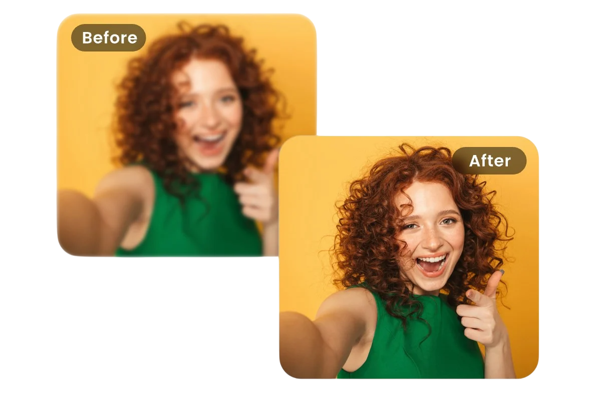
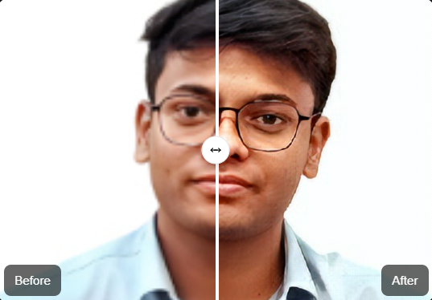

<div align="center">
  
  <h1>Photo Elevate - AI Image Upscaler</h1>
  <p>Enhance and upscale your images using advanced AI models. Built with Next.js, TypeScript, and a modern UI.</p>
</div>

---

## 🚀 Features

- AI-powered image upscaling (ESRGAN, DeepAI, ClipDrop fallback)
- Drag & drop or file upload
- Before/after comparison slider
- User authentication (NextAuth.js)
- Credit system for API usage
- Responsive, modern UI (Tailwind CSS)
- Error handling and fallback APIs

---

## 🖼️ Work Demo



---

## 🛠️ Getting Started

1. **Clone the repo:**

   ```bash
   git clone https://github.com/abhi24112/Photo-Elevate-SaaS-Project.git

   cd photo-elevate
   ```

2. **Install dependencies:**
   ```bash
   npm install
   ```
3. **Set up environment variables:**

   - Copy `.env.sample` to `.env` and fill in your keys:

     - `MONGODB_URI` (MongoDB connection string)

   - `Brevo SMTP (Nodemailer)`

     - `NODEMAILER_USER`
     - `NODEMAILER_PASSWORD`
     - `NODEMAILER_HOST`

   - `Google Auth `

     - `AUTH_GOOGLE_ID`
     - `AUTH_GOOGLE_SECRET`
     - `AUTH_SECRET`
     - `NEXTAUTH_URL`

   - `CLIP_DROP_KEY` (ClipDrop API key)

4. **Run the development server:**
   ```bash
   npm run dev
   ```
5. **Open in browser:**
   [http://localhost:3000](http://localhost:3000)

---

## 📦 Project Structure

```
photo_enhancer/
├── public/
├── src/
│   ├── app/
│   │   ├── api/
│   │   │   ├── auth/
│   │   │   │   └── [...nextauth]/
│   │   │   │       └── route.ts
│   │   │   └── users (route.ts 's files)/
│   │   │       ├── clipdropupscale/
│   │   │       ├── credits/
│   │   │       ├── creditupdate/
│   │   │       ├── forgotpassword/
│   │   │       ├── login/
│   │   │       ├── logout/
│   │   │       ├── resetpassword/
│   │   │       ├── signup/
│   │   │       └── verifyemail/
│   ├── components/
│   ├── dbConfig/
│   ├── helper/
│   ├── lib/
│   ├── model/
│   ├── store/
│   └── ...
├── .env
├── package.json
└── README.md
```

### API Structure

```
src/app/api/
├── auth/
│   └── [...nextauth]/
│       └── route.ts
└── users/
   ├── clipdropupscale/
   ├── credits/
   ├── creditupdate/
   ├── forgotpassword/
   ├── login/
   ├── logout/
   ├── resetpassword/
   ├── signup/
   └── verifyemail/
```

---

## ⚡ API Usage

- **GitHub Repo:** `https://github.com/abhi24112/ESRGAN_Model_Flask_API.git`

- **Local ESRGAN API:** `http://127.0.0.1:5000/upscale`
- **ClipDrop API:** [clipdrop-api.co](https://clipdrop.co/apis/image-upscaling)

> The app will automatically use fallback APIs if the primary upscaling API is unavailable or quota is exceeded.

---

## 🧑‍💻 Contributing

1. Fork the repo
2. Create your feature branch (`git checkout -b feature/YourFeature`)
3. Commit your changes (`git commit -m 'Add some feature'`)
4. Push to the branch (`git push origin feature/YourFeature`)
5. Open a Pull Request

---

## 📄 License

This project is licensed under the CC0 1.0 Universal License.

---

## 🙏 Credits

- [Next.js](https://nextjs.org/)
- [ESRGAN](https://github.com/xinntao/ESRGAN)
- [ClipDrop API](https://clipdrop.co/apis/image-upscaling)
- [Tailwind CSS](https://tailwindcss.com/)

---

<div align="center">
  <sub>Made with ❤️ by Abhishek Prajapati</sub>
</div>
